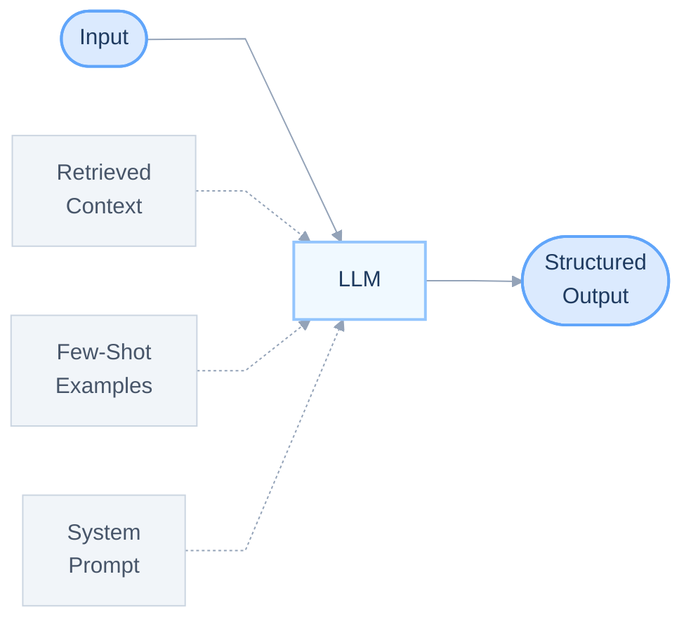
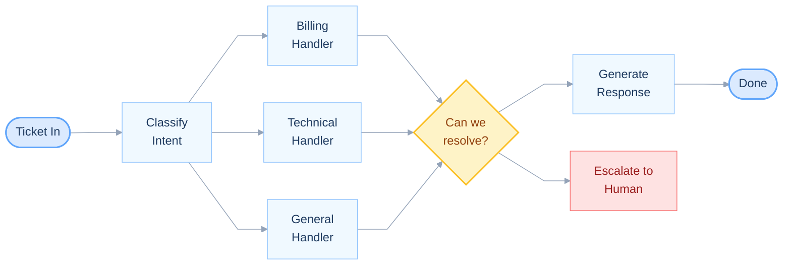
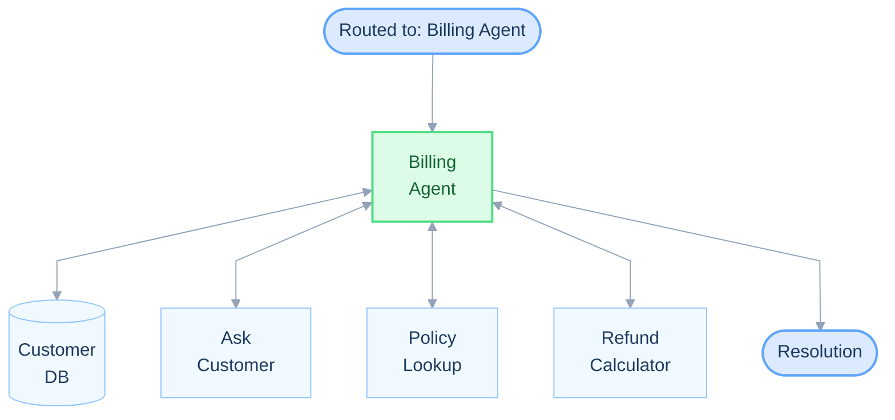
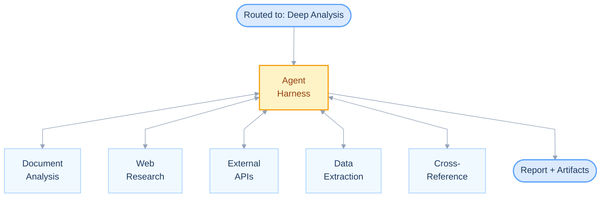
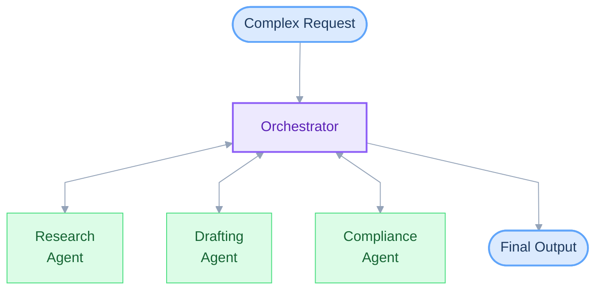
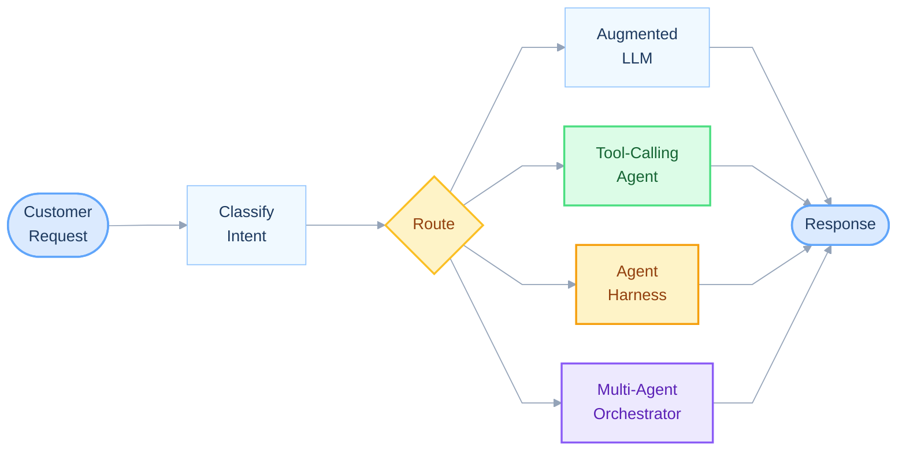

# The 5 Levels of AI Autonomy

The best production AI systems use the simplest level of autonomy at each step — and only escalate complexity when the task demands it.

| Level | Pattern | Code | Framework |
|---|---|---|---|
| 1 | Augmented LLM | [`1-augmented-llm.py`](1-augmented-llm.py) | PydanticAI |
| 2 | Prompt Chains & Routing | [`2-prompt-chains.py`](2-prompt-chains.py) | PydanticAI |
| 3 | Tool-Calling Agent | [`3-tool-calling-agent.py`](3-tool-calling-agent.py) | PydanticAI |
| 4 | Agent Harness | [`4-agent-harness.py`](4-agent-harness.py) | Claude Agent SDK |
| 5 | Multi-Agent Orchestration | [`5-multi-agent.py`](5-multi-agent.py) | Claude Agent SDK |

---

## Level 1: Augmented LLM — Single API Call

One model call with the right context: system prompt, few-shot examples, structured output, retrieval. No loops, no tools, no autonomy. This handles more than most people think.

---

## Level 2: Prompt Chains & Routing — Deterministic DAGs

Multiple LLM calls orchestrated through fixed paths. Each step validates its output before passing to the next. No model makes decisions about control flow — the code does.

---

## Level 3: Tool-Calling Agent — Scoped Autonomy

The agent decides which tools to call and in what order, but only within a fixed set of well-defined capabilities. This is where real autonomy starts.

---

## Level 4: Agent Harness — Full Runtime Access

Instead of hand-picking tools, you give the agent a full runtime — document analysis, web research, API access, dynamic data extraction. The agent reasons about what to do, executes, observes, and iterates.

---

## Level 5: Multi-Agent Orchestration — Delegated Autonomy

An orchestrator decomposes the task and delegates to specialized worker agents, each with their own tools and context. Every worker reports back to the orchestrator — it decides what to delegate next, what to retry, and when to finalize.

---

## The Full Picture: All Five Combined

The routing decision isn't about severity — it's about what the task *needs*. Each level trades off cost, latency, reliability, and capability differently. Use the simplest level that gets the job done.

| | Augmented LLM | Tool-Calling Agent | Agent Harness | Multi-Agent |
|---|---|---|---|---|
| **Cost** | $ | $$ | $$$ | $$$$ |
| **Latency** | ~1s | ~5s | ~30s+ | ~60s+ |
| **Reliability** | Deterministic | High | Medium | Lower |
| **When to use** | Answer is retrievable | Needs a few specific tools | Needs exploration and reasoning | Needs parallel domain expertise |

