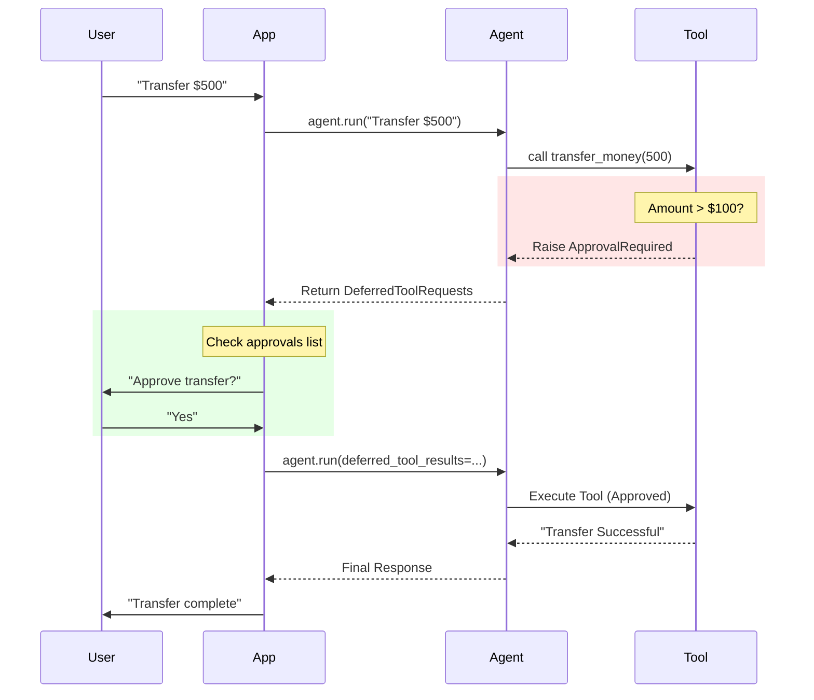

# Human-in-the-loop with PydanticAI

This example demonstrates how to implement a [human-in-the-loop workflow](https://ai.pydantic.dev/deferred-tools/#human-in-the-loop-tool-approval) using PydanticAI's deferred tool mechanism. It simulates a banking assistant that pauses for user approval when a high-risk action (transferring > $100) is requested.

## How it Works

PydanticAI allows tools to raise an `ApprovalRequired` exception. When this happens:
1. The agent execution pauses.
2. The `run_sync` (or `run`) method returns a `DeferredToolRequests` object instead of the final result.
3. The application (you) can inspect the request, ask the user for permission, and resume execution.

### Architecture



## Key Concepts

### 1. Raising Approval Request
Inside your tool, check the `ctx.tool_call_approved` flag. If it's false (default for the first call) and the action requires approval, raise the exception.

```python
@agent.tool
def sensitive_action(ctx: RunContext, amount: int):
    if amount > 100 and not ctx.tool_call_approved:
        raise ApprovalRequired()
    # ... proceed with action
```

### 2. Handling the Pause
The agent returns a special `DeferredToolRequests` object containing the tool calls that need approval.

```python
result = agent.run_sync(prompt)

if isinstance(result.output, DeferredToolRequests):
    # The agent has paused!
    for approval in result.output.approvals:
        print(f"Tool: {approval.tool_name}")
        print(f"Args: {approval.args}")
```

### 3. Resuming Execution
To resume, you create a `DeferredToolResults` object and map the `tool_call_id` to your decision (`True` for approved, or `ToolDenied` for rejected).

```python
tool_results = DeferredToolResults()
# Approve a specific call
tool_results.approvals[tool_id] = True 

# Resume the agent
final_result = agent.run_sync(
    message_history=result.all_messages(), # Pass full history
    deferred_tool_results=tool_results     # Pass your decisions
)
```