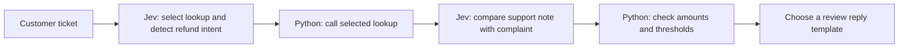

# Designing a Workflow

[Back to the tutorial](../README.md)

A customer asking for a duplicate-charge refund needs more than a category label. The application has to find the order, check the charges, and decide what to do next. **Jev handles the interpretation, while Python handles retrieval and exact rules.**

## Following a refund request

The [multistep example](../09-multistep-workflow.py) connects those operations:

For the fictional duplicate-charge ticket, the first call chooses an order lookup and detects refund intent. Python supplies the order ID from the ticket record, then retrieves the local example data. The second call compares the newly fetched support note with the complaint. Python adds the charges and checks whether they exceed the expected total.

**The second call has a real dependency: new evidence.** Asking it earlier would mean judging a support note that we had not fetched. Conversely, splitting independent questions into separate calls would add unnecessary round trips. This follows TypeSafe's [workflow guidance](https://docs.typesafe.ai/concepts/how-to-build-with-system-one).

## Drafting a reply

**A generative LLM can draft a natural reply from verified facts** when a template is insufficient. Example [04-intent-routing.py](../patterns/04-intent-routing.py) demonstrates this with a real Haiku draft after Jev routes the ticket. Example 09 keeps the reply as a fixed template. Calculation, authorization, and actual refund execution remain application responsibilities.

## Latency in the routing example

The [speed comparison](../10-speed-comparison.py) runs Jev, Claude Haiku 4.5, Opus 5, and Fable 5.1 three times on the same routing task. It prints the selected category, request time, and average for each model.

The measurement includes network and SDK overhead, including connection setup on the first request. Claude returns the category as text using its default thinking behavior. Three calls on one ticket illustrate latency, but do not establish production accuracy or a general speed ranking.

TypeSafe's own evaluation uses structured workflows and model-consensus reference answers. That is a different experiment from our single-label benchmark. Its results are not directly interchangeable with the measurements above. [Vendor evaluation methodology](https://evals.typesafe.ai/).

## Where Jev fits

**I would try Jev when the useful answer is bounded:** routing, interpreting a request, choosing a lookup, or rating a clearly defined property. I would keep a generative LLM available for open-ended writing or explanations, and use deterministic code whenever the rule is already exact.

The current model has documented weaknesses with arithmetic, dates, indirect reasoning, distracting context, and adversarial content. Better question design helps, but does not remove the need to evaluate your application. [Known limitations](https://docs.typesafe.ai/model-jaggedness/jev-1.13).

In this tutorial, Choice selects the team or tool, Score measures frustration, and Noul estimates whether the customer wants a refund. Python calculates the overcharge, and the multistep example uses a fixed reply template. The intent-routing example adds Haiku when a written response is useful.

The [tutorial README](../README.md) covers setup and walks through the runnable examples, starting with a single Choice request.
