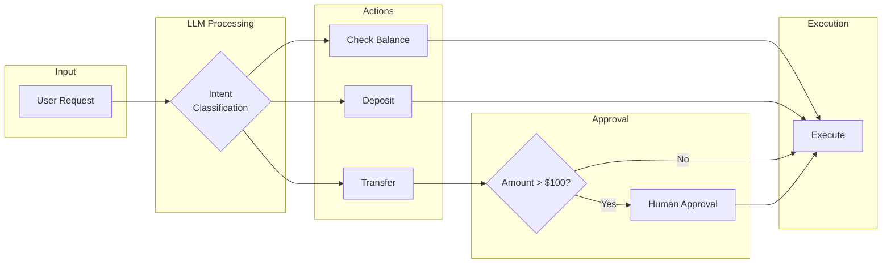
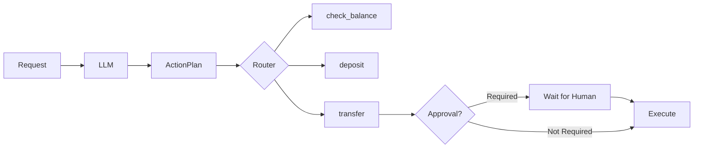
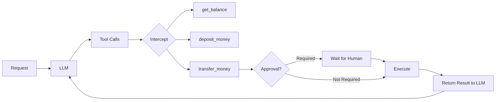
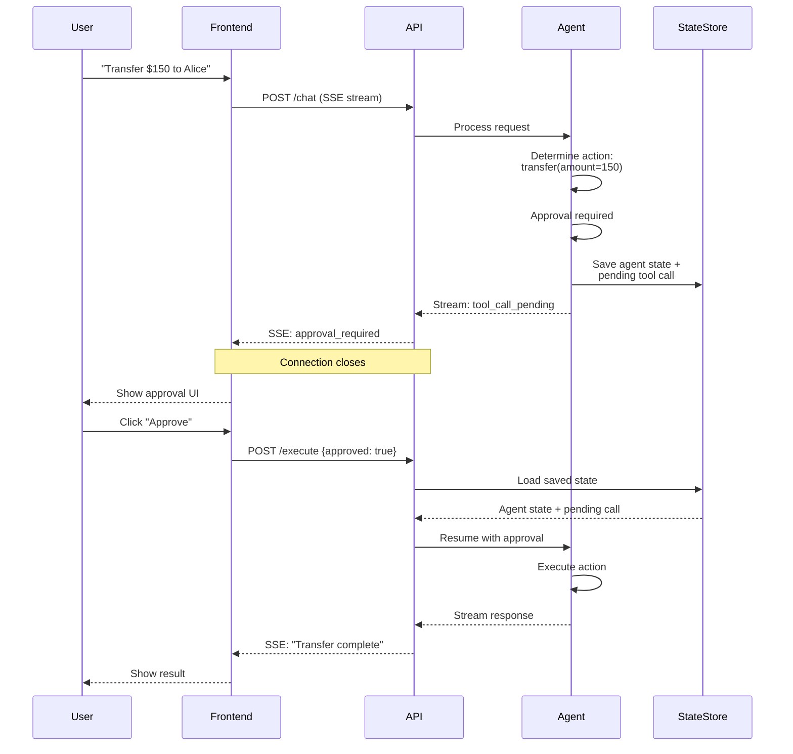
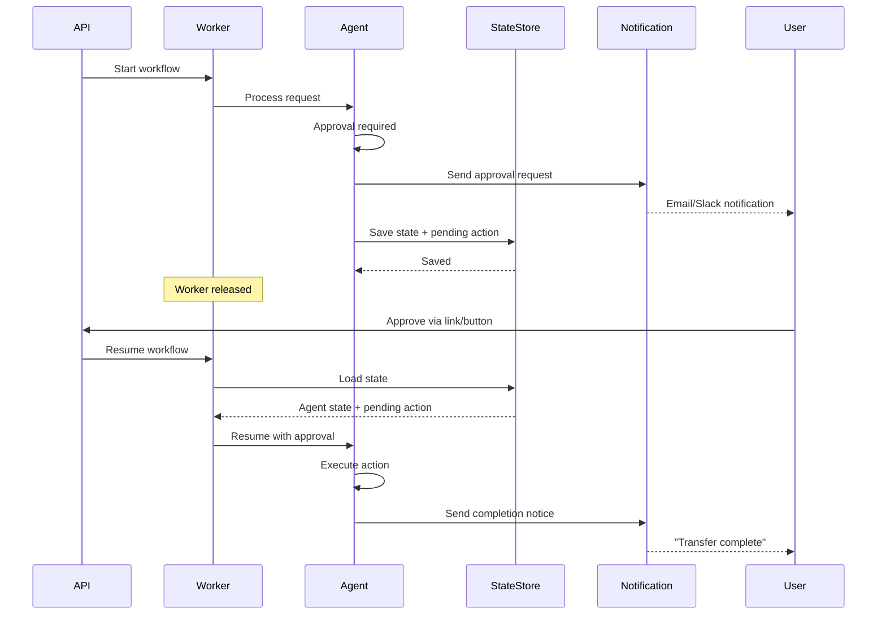

# Human-in-the-Loop Patterns

When building AI agents that perform real-world actions, you need human oversight for high-risk operations. This tutorial shows how to pause execution and require approval before proceeding.

## The Banking Example

Both examples implement the same banking workflow with three operations:

The key insight: **transfers over $100 require human approval before execution**.

## Two Approaches

### Approach 1: LLM as Router (Structured Output)

The LLM outputs a structured action plan with multiple actions. Your code loops through and executes each one.

**File:** `1-structured-output.py`

- LLM returns `ActionPlan` with list of typed actions
- Loop through each action and route to function
- Pydantic validator enforces approval rule
- Your code executes each action

### Approach 2: LLM with Tool Calls

The LLM decides which tools to call. You intercept, execute, and return results in a loop.

**File:** `2-tool-call-approval.py`

- LLM returns tool calls with arguments
- Loop through each call, check approval, execute
- Return all results to LLM for next iteration

### When to Use Each

| Approach | Recommendation |
|----------|----------------|
| Structured Output | **Recommended for most use cases.** Gives you full control over execution. Ideal for DAGs, graph-based orchestration, and smaller workflows. More reliable and predictable in production. |
| Tool Calls | **Recommended for interactive chat applications.** Better for multi-step agents, larger agentic loops, and scenarios where the LLM needs to adapt based on previous results. |

---

## Production Patterns

The examples above use `input()` to block for approval. In production, you need to **persist state** and **resume later**. Two patterns:

### Pattern 1: SSE Streaming (Real-time Chat)

For interactive chat applications where a user is actively engaged.

### Pattern 2: Async with State Persistence

For backend workflows where no user is actively waiting. Works the same whether triggered by API, webhook, or queue.

### Key Concepts

| Concept | Description |
|---------|-------------|
| **Deferred Execution** | When approval is needed, save state instead of executing |
| **State Serialization** | Persist agent context, message history, and pending actions |
| **Stateless Resume** | Load state from storage, don't hold in memory |